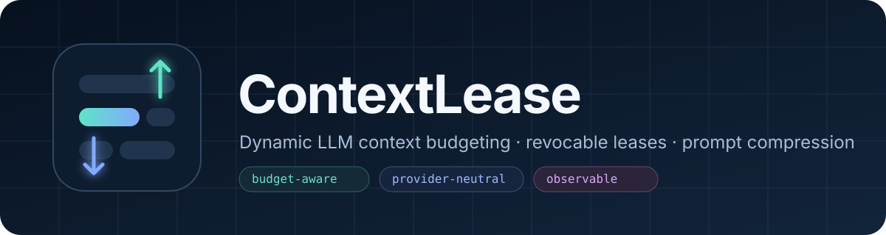
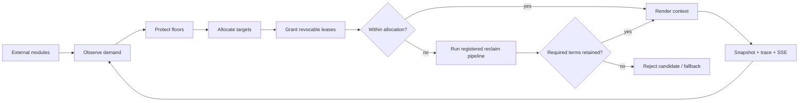
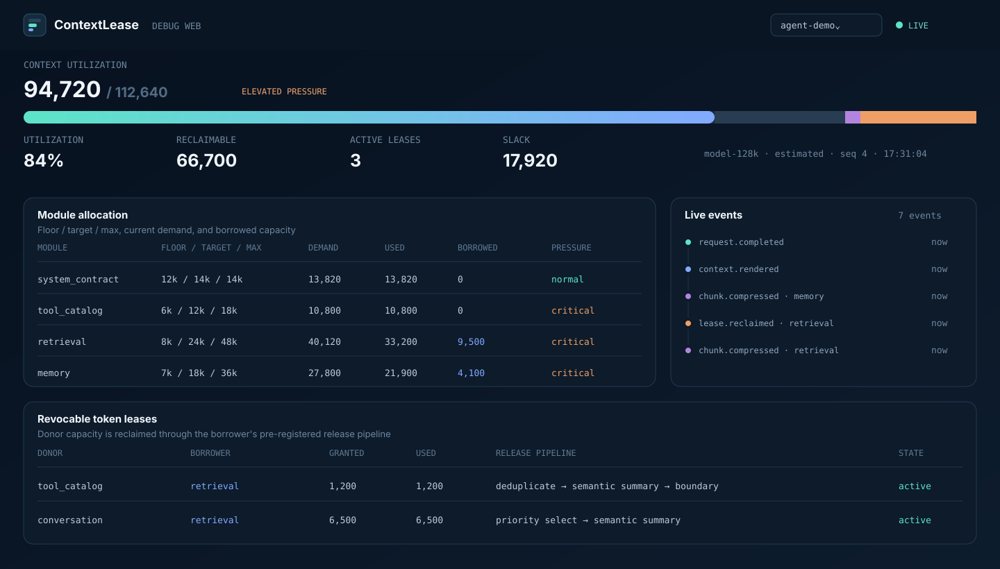

<p align="center">
  
</p>

<p align="center">
  <a href="https://github.com/Silicon-based-Life/ContextLease/actions/workflows/ci.yml"></a>
  
  
  <a href="https://www.python.org/"></a>
  <a href="LICENSE"></a>
</p>

**ContextLease** is a provider-neutral, cross-language framework for building prompts under a hard LLM context limit. A canonical Rust core is exposed through a stable C ABI to Rust, C, C++, Python, Go, C#, and Unity. It gives every prompt module a floor, target, and maximum budget; lets modules borrow unused capacity through revocable leases; and reclaims borrowed space through a pre-registered compression pipeline when another module needs it back.

It is designed for agent runtimes, RAG systems, assistants, and any application where system rules, tools, memory, retrieved documents, and conversation history compete for the same context window.

> The central rule: **a module may borrow tokens only after registering how those tokens can be released.**

## Why ContextLease

Most prompt builders concatenate content and truncate at the end. That makes context pressure a late, opaque failure. ContextLease turns it into an explicit resource-management loop:

| Need | ContextLease primitive |
|---|---|
| Protect critical rules | floors, fixed chunks, pinned protection |
| Share unused context | weighted allocation and revocable token leases |
| Recover capacity later | registered deterministic or semantic reclaim pipelines |
| Adapt to different models | runtime `ModelProfile` and output-token reserve |
| Understand prompt pressure | snapshots, event traces, REST, SSE, Debug Web |
| Avoid vendor lock-in | built-in OpenAI-compatible adapter plus optional LiteLLM adapter |

## Quick start

ContextLease has no required runtime dependencies.

```bash
pip install git+https://github.com/Silicon-based-Life/ContextLease.git
contextlease demo --open
```

From a source checkout:

```bash
python -m pip install -e .
contextlease validate examples/demo.json
contextlease prepare examples/demo.json
contextlease demo --open
```

## Python API

The external application owns the module boundaries and initializes the static/dynamic distribution. ContextLease owns allocation, reclamation, compression, and observation.

```python
from contextlease import (
    ArenaDefinition, CompressionStepSpec, ContextLeaseArena,
    ModelProfile, ModuleContribution, ModuleDefinition, PromptChunk,
)

definition = ArenaDefinition(
    arena_id="support-agent",
    framework_reserve_tokens=128,
    modules=(
        ModuleDefinition(
            "system", floor_tokens=500, target_tokens=700, max_tokens=700,
            can_borrow=False, can_lend=False,
        ),
        ModuleDefinition(
            "memory", floor_tokens=300, target_tokens=900, max_tokens=2400,
            reclaim_pipeline=(
                CompressionStepSpec("builtin.text.deduplicate_blocks.v1"),
                CompressionStepSpec("builtin.text.extractive_sentence_rank.v1"),
                CompressionStepSpec("builtin.text.boundary_truncate.v1"),
            ),
        ),
    ),
)

arena = ContextLeaseArena(definition)
prepared = arena.prepare(
    ModelProfile("model-8k", context_limit_tokens=8192, reserved_output_tokens=1024),
    (
        ModuleContribution("system", (PromptChunk("rules", "Never invent tool output.", fixed=True),)),
        ModuleContribution("memory", (PromptChunk("facts", long_memory_text),)),
    ),
)

send_to_model(prepared.rendered)
```

## Cross-language native core

All native bindings consume the same JSON arena/request contract and the same fixtures under `spec/conformance`. The ABI is versioned independently and rejects incompatible libraries before creating an arena.

Version 0.2 moves deterministic allocation, leasing, reclaim, and the four text compression passes into the canonical core. Provider-backed semantic summarization uses a host-callback two-phase transaction: `prepare_begin` returns content-bearing provider requests, the host invokes its configured provider, and `prepare_commit` validates request ids, monotonic size, required terms, and the final hard budget before mutating arena state.

| Consumer | Integration form | Location |
|---|---|---|
| Rust | direct crate | `rust/contextlease-core` |
| C | stable C ABI | `bindings/c/include/contextlease.h` |
| C++ | header-only RAII wrapper over C ABI | `bindings/cpp/include/contextlease.hpp` |
| Python | in-process `ctypes` binding | `contextlease.NativeArena` |
| C# / Unity | `netstandard2.0` + `net471` P/Invoke library | `bindings/dotnet` |
| Go | cgo package | `bindings/go` |

```python
from contextlease import NativeArena

with NativeArena(arena_definition) as arena:
    prepared = arena.prepare(prepare_request)
```

```csharp
using var arena = new ContextLease.ContextLeaseArena(definitionJson);
string preparedJson = arena.PrepareJson(requestJson);
```

```go
arena, err := contextlease.NewArena(definitionJSON)
if err != nil { panic(err) }
defer arena.Close()
preparedJSON, err := arena.Prepare(requestJSON)
```

## Control loop



On every `prepare()` call, demand is measured again. If a donor grows, old leases are recalculated and the borrower releases the reclaimed capacity using the pipeline it registered before borrowing.

## LLM summarization providers

Semantic compression is optional and configuration-driven. API keys are never accepted inline; use environment-variable names.

### OpenAI-compatible HTTP

This zero-dependency adapter works with services exposing a compatible `/chat/completions` endpoint.

```json
{
  "providers": {
    "primary": {
      "type": "openai-compatible",
      "base_url": "https://api.example.com/v1",
      "model": "example-model",
      "api_key_env": "EXAMPLE_API_KEY",
      "timeout_seconds": 30
    }
  }
}
```

Register it in a module's reclaim pipeline:

```json
{
  "algorithm_id": "builtin.semantic.summary.v1",
  "options": {
    "provider": "primary",
    "instructions": "Keep decisions, qualifiers, unresolved items, and required terms."
  }
}
```

### LiteLLM adapter

LiteLLM support is lazy and bring-your-own: ContextLease does not install it transitively.

```bash
pip install litellm
```

```json
{
  "providers": {
    "router": {
      "type": "litellm",
      "model": "openai/your-model",
      "api_key_env": "MODEL_API_KEY",
      "options": {"num_retries": 2}
    }
  }
}
```

Use `builtin.semantic.portfolio.v1` with a `providers` list to evaluate multiple configured summarizers and select the shortest candidate that retains every required term.

## Compression catalog

ContextLease ships 14 algorithms. Pipelines can mix cheap deterministic passes with a semantic summary and a final hard boundary.

| Family | Algorithms |
|---|---|
| Text | whitespace normalization, block deduplication, extractive sentence ranking, boundary truncation |
| Collections | exact/similarity deduplication, priority selection, recency selection |
| Structured | JSON minification, field pruning, atomic message-group selection |
| References | externalize content behind a reference marker |
| Semantic | single-provider summary, multi-provider portfolio |

Compression results are accepted only when they are monotonic, fit the target, and preserve configured `required_terms`. Pinned content is never sent through reclaim.

## Real-time Debug Web

```bash
contextlease demo --open
```

The read-only dashboard shows:

- total context utilization, reserve, slack, and pressure;
- each module's floor, target, max, demand, allocation, fixed/variable split, and change rate;
- active donor → borrower leases and reclaim pipelines;
- compression and allocation events over REST and Server-Sent Events.

Prompt content is excluded from public telemetry. The server binds to `127.0.0.1` by default; a non-loopback bind requires an authentication token.



## Configuration contract

The packaged JSON Schema is available at `contextlease.schema/contextlease.schema.json`. The complete runnable configuration is in [`examples/demo.json`](examples/demo.json).

```text
external system
  ├─ defines module identity and lifecycle
  ├─ supplies fixed and variable chunks
  └─ selects model profile and summary providers

ContextLease
  ├─ compiles and validates the arena
  ├─ allocates floor → target → borrowed capacity
  ├─ reclaims through registered pipelines
  ├─ renders the prepared context
  └─ emits content-free telemetry
```

## Design guarantees

- `floor_tokens <= target_tokens <= max_tokens` is validated before runtime.
- Borrow-capable modules with headroom must register a reclaim pipeline.
- Model output reserve and framework reserve are removed before allocation.
- Fixed/pinned content cannot be silently compressed.
- Provider secrets come from environment variables, not JSON.
- Remote Debug Web exposure requires authentication.
- Events and snapshots omit prompt text by default.

## Development

```bash
python -m compileall -q src
python -m unittest discover -s tests -v
node --check src/contextlease/debug/static/app.js
cargo fmt --all -- --check
cargo test --workspace
cargo build --workspace --release
dotnet build bindings/dotnet/src/ContextLease.Managed/ContextLease.Managed.csproj -c Release
```

See [CONTRIBUTING.md](CONTRIBUTING.md), [architecture](docs/architecture.md),
[native bindings](docs/native-bindings.md), and [provider guide](docs/providers.md).

## Search keywords

`LLM context management` · `prompt compression` · `token budgeting` · `AI agent memory` · `context window` · `prompt management framework` · `revocable lease` · `LiteLLM` · `OpenAI-compatible` · `LLM observability`

## License

Apache-2.0. See [LICENSE](LICENSE) and [NOTICE](NOTICE).
