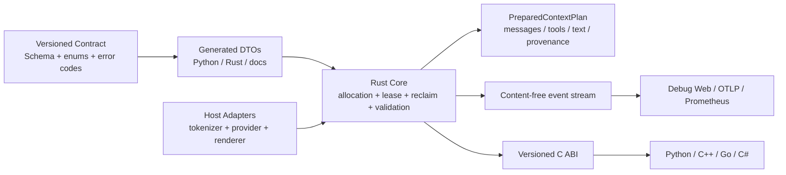

# ContextLease 通用开源框架评审

> 审查日期：2026-07-20 
> 审查对象：`AIWorkSpace/ContextLease` 
> 源码基线：`622ca0c3077dad3d21894ce71a76f9ef6e1d3f39`，分支 `agent/rust-multilang-contextlease` 
> 工作模式：只读评审；未修改 ContextLease 源码

## 结论

ContextLease 的产品方向和核心抽象是合理的：它把 prompt/context 当成受限资源，使用 `floor → target → lease → reclaim` 管理模块预算，且把模块语义、模型选择和 Provider 凭证留给宿主系统。这一定位足够通用，也与 AINPC 解耦。

但当前更准确的成熟度是 **0.2.0 Alpha 原型**，还不能对外宣称为“行为一致的 Rust 单核心、多语言通用框架”。首要问题不是压缩算法数量，而是以下四点：

1. JSON Schema、Python 枚举和 Rust DTO 不是同一份可执行契约。
2. Python 默认使用独立的纯 Python 核心，Rust `NativeArena` 只是显式选择；两套核心能力已发生漂移。
3. 多个公开策略字段目前只被解析或展示，并没有真正影响分配、生命周期、回收和渲染。
4. 精确 tokenizer、结构化消息/tool schema 输出和跨语言可观测性尚未进入 Rust ABI。

建议先完成 P0 契约收敛与发布闭环，再扩展算法和自适应策略。当前综合成熟度约 **5.3/10**：架构方向强，工程地基尚未达到稳定公共 API 的标准。

## 成熟度评分

| 维度 | 评分 | 判断 |
|---|---:|---|
| 产品定位与差异化 | 8/10 | revocable token lease + registered reclaim 有明确辨识度 |
| 宿主边界与通用性 | 8/10 | 核心没有 AINPC/RAG/Agent 框架强耦合 |
| 分配与回收基础实现 | 7/10 | floor/target/max、借用、回收和 pinned 保护已形成闭环 |
| 配置/API 契约一致性 | 2/10 | Schema、Python、Rust 字段和值域明显漂移 |
| Rust 单核心一致性 | 3/10 | Python 默认仍走独立实现，算法目录也不一致 |
| Token 计算准确性 | 3/10 | Rust 只有估算器；`tiktoken_*` 仍按字符估算 |
| 结构化上下文支持 | 3/10 | 最终产物仍是扁平字符串，render target 未兑现 |
| 可观测性 | 7/10（Python）/2/10（Native） | Python Debug Web 完整，Rust/其他语言缺事件出口 |
| 测试与兼容性 | 5/10 | Python 测试较好，但跨语言 conformance 只有一个宽松 fixture |
| 发布与安装体验 | 4/10 | release workflow 已有骨架，原生库仍需手工配套 |

## 已经合理、应当保留的设计

- **外部初始化模块布局**：静态/动态模块、预算、权重、是否借用和可压缩内容由宿主定义，符合通用库边界。
- **强制注册释放路径**：允许借用但没有 `reclaim_pipeline` 时拒绝布局，保留了 lease 的可回收承诺。
- **请求事务内回收**：没有后台线程修改 prompt；下一次 `prepare()` 根据新需求重新计算租约，结果可复现。
- **固定/弹性内容隔离**：fixed/pinned 内容不会静默进入压缩管线。
- **两阶段语义压缩**：Rust core 只生成语义请求，Provider 调用由宿主完成，避免把凭证和网络 SDK固化进核心。
- **内容默认不进入遥测**：Debug Web 使用计数、ID、策略和哈希，隐私边界清楚。
- **独立模块定位**：架构文档明确核心不含 AINPC、RAG 或特定 Agent 框架逻辑，应继续坚持。

## P0：发布前必须解决

### P0-1 统一配置契约，禁止“Schema 通过、运行时失败或静默忽略”

当前存在三份不同事实：

| 字段 | JSON Schema | Python 枚举 | Rust core |
|---|---|---|---|
| `lifecycle` | `static/session/request/turn/ephemeral` | `application/session/request/turn/loop/event_driven` | 字段不存在，输入时被忽略 |
| `allocation` | `fixed/weighted/priority/elastic` | `fixed/weighted/demand_driven/adaptive/external` | 字段不存在，输入时被忽略 |
| `reclaim` | `none/builtin_pipeline/semantic_pipeline/custom` | `none/builtin_pipeline/deterministic/cached_variant/reference/portfolio/custom_plugin` | 字段不存在，输入时被忽略 |
| `render_target` | `text/messages/tool_schema/structured` | `text/messages/tools/custom` | 字段不存在，输入时被忽略 |
| `count_mode` | `exact/estimated/hybrid` | `estimated/exact/calibrated` | 字段不存在，输入时被忽略 |

实测结果：上述五个 Schema 合法值均会在 Python loader 中抛出 `ValueError`；Rust native 对 `allocation=fixed/weighted/priority/elastic` 生成相同 `layout_hash` 和相同分配结果，说明字段被静默丢弃。

同时，CLI 的 `validate` 并未运行 JSON Schema 校验。`arena_from_dict()` 会接受 Schema 明确禁止的未知字段，因而“valid”只表示手工构造和预算检查通过。

建议：

1. 建立唯一版本化契约，例如 `spec/contextlease.contract.v1.json`。
2. 由契约生成 Python enum/dataclass、Rust enum/struct 和语言绑定 DTO 文档。
3. Rust DTO 加 `#[serde(deny_unknown_fields)]`；Python loader 先执行同一 JSON Schema。
4. 未实现字段标记为 `experimental/reserved`，不要放进稳定 Schema。
5. CI 加入 schema corpus：每个合法枚举值必须被 Python 和 Rust 接受，每个非法/未知字段必须以同一错误码拒绝。

源码证据：

- `src/contextlease/schema/contextlease.schema.json:52-56,84-86`
- `src/contextlease/enums.py:6-50`
- `src/contextlease/config.py:56-100`
- `rust/contextlease-core/src/lib.rs:18-56`

### P0-2 明确并兑现“Rust canonical core”

当前 `contextlease.ContextLeaseArena` 导出的是完整纯 Python 实现，而 `NativeArena` 是单独、显式选择的 `ctypes` 桥。Python wheel 也没有包含原生库。结果是：

- README 快速开始默认走 Python core；
- Python 有 14 个算法；Rust 只有 4 个文本算法和 2 个语义请求类型；
- C++、Go、C# 和直接 Rust 用户得到的能力集小于 Python；
- 同一版本号并不代表同一运行语义。

建议二选一，并在 0.3.0 前锁定：

**推荐方案：Rust 主实现。** 高层 Python API 默认委托 Rust core；纯 Python 实现改名为 `contextlease.reference` 或显式 fallback。为 Python 发布平台 wheel，把 native library 打包进 wheel，并保持一个 Pythonic facade。

备选方案是承认 Python 为参考实现，Rust 为受限子集；但这会削弱“多语言同一框架行为”的卖点。

源码证据：

- `src/contextlease/__init__.py:30-33`
- `src/contextlease/native.py:1-6,31-46`
- `src/contextlease/compression/builtin.py:349-365`
- `rust/contextlease-core/src/lib.rs:921-936`
- `pyproject.toml:40-49`

### P0-3 收敛版本和主分支发布状态

- 包版本、Cargo、C# 和 README 是 `0.2.0`，但 CLI `--version` 仍硬编码为 `0.1.0`。
- `verify_release_versions.py` 没有覆盖 CLI，因此“release metadata consistent”是漏检。
- 本地远端跟踪快照中，完整多语言实现位于 `agent/rust-multilang-contextlease`；默认 `main` 仍停留在 `fecb4ba`，两者相差 3271 行新增内容；当前没有本地 tag。

建议把版本读取统一到包 metadata/Cargo 常量，CI 对 CLI、ABI、NuGet、archive 名称、文档 badge 做端到端断言；完成主分支合并后再打预发布 tag。

源码证据：`src/contextlease/cli.py:84-86`、`scripts/verify_release_versions.py:19-41`。

## P1：形成可信通用框架能力

### P1-1 让公开策略真正改变行为

Python allocator 无条件采用 weighted fill；`allocation` 字段不参与算法。`lifecycle`、`reclaim`、`render_target` 和 `admission_policy` 也没有控制对应运行时行为。`count_mode` 只进入遥测；`change_rate` 只是单次差分指标，没有参与扩容、回收或稳定性控制。

建议先把每个字段做成“契约行为表”，再实现或删除：

| 策略 | 最小可验证语义 |
|---|---|
| `fixed` | 只分配固定额度，不参与 weighted fill 和借用 |
| `weighted` | 当前权重分配 |
| `priority` | 明确优先级和饥饿保护 |
| `adaptive` | 根据 EWMA/分位数需求预测扩缩容 |
| `external` | 宿主提供 allocation plan，core 只验证硬约束 |
| lifecycle | 定义跨 application/session/turn/request 的缓存、过期和状态边界 |
| reclaim policy | 决定是否可回收、使用何种管线、失败时 admission 行为 |
| admission policy | 至少支持 reject、drop-low-priority、fallback-render 三种明确结果 |

自适应控制建议增加：EWMA demand、峰值分位数、lease TTL、回收冷却时间、reclaim cost、最小驻留时间、连续两次阈值触发，避免配额抖动。

### P1-2 增加真实 tokenizer 接口与实际用量校准

Rust core 目前把 `tiktoken_*` 当作字符估算器，不是对应模型的真实 tokenizer。C ABI 也没有 token callback；因此 Python 可注入 `TokenCounter` 的能力无法传递给 C++、Go、C# 或 Rust native 用户。

建议 ABI v2 支持两种模式：

1. 宿主回调：`count_text`、`count_messages`、`count_tools`；
2. 宿主预计算：chunk 携带 `measured_tokens`、`tokenizer_fingerprint`，core 校验版本与一致性。

再加入 model response 的实际 input usage 回灌，按 `model + tokenizer_version + render_adapter` 校准估算误差，并为硬上限保留安全余量。

源码证据：`rust/contextlease-core/src/lib.rs:992-1048`、`bindings/c/include/contextlease.h:15-23`。

### P1-3 输出结构化 PreparedContext，而不是只返回扁平字符串

Python 和 Rust 都把 chunk JSON 化后用空行拼接，最终只返回 `rendered: String`。这无法完整表达：

- chat messages 的 role、name、tool_call_id 和原子组；
- tool schema/function definitions；
- provider 特定序列化开销；
- 模块级 provenance 与被删除项。

建议新增 `PreparedContextPlan`：保留 modules、chunks、messages、tools、metadata 和 compression decision；由宿主 render adapter 生成 OpenAI/Anthropic/自定义请求。core 在 adapter 生成的 canonical representation 上做最后一次 token 校验。保留 `rendered_text` 作为便捷输出，但不再是唯一输出。

源码证据：`src/contextlease/runtime.py:45-48,380-390`、`rust/contextlease-core/src/lib.rs:153-168,393-425`。

### P1-4 强化语义压缩的安全、成本和可靠性合同

现有两阶段 host-callback 设计值得保留，但验证条件主要是“非空、没有变长、包含 required terms”。这不能证明事实、否定词、限定条件、引用或工具协议仍被保留。

建议增加：

- `required_facts`/JSON Pointer/消息依赖组/实体 ID 等结构化 retention contract；
- source hash、provider、model、prompt version、latency、cost、attempt 的审计记录；
- 基于 content hash + policy + model 的摘要缓存和失效策略；
- deadline、cancellation、最大费用、最大尝试次数；
- portfolio 并发 fan-out 和 host 可配置选择器，而不是固定串行最短文本；
- 对 prompt injection 和输出格式的结构化隔离与校验。

### P1-5 建立真正的跨语言 conformance 与性质测试

当前验证结果：

- Python：58/58 通过（含 native 2 个测试）；
- Rust workspace：6/6 通过；
- .NET managed library：`netstandard2.0`、`net471` 构建通过；
- JavaScript 静态语法、release metadata 检查通过；
- Go 在本机缺少工具链，未本地执行；CI 配置了 Go 1.22；
- 共享 conformance fixture 只有 1 个，而且 Python native 与 Rust 只分别检查少量宽松断言，并未比较完整结构或纯 Python/Rust 等价性。

建议最少建立以下测试层：

1. 20+ 个 contract fixtures：每个策略、生命周期、render target、算法、错误码和边界值。
2. Python reference ↔ Rust core 的 canonical JSON golden comparison。
3. C/C++/Go/C#/Python binding 在 Windows、Linux、macOS 的同 fixture 结果比较。
4. property tests：总分配不超预算、pinned 不丢失、压缩不增长、租约必有释放路径、排序稳定。
5. fuzz：FFI JSON、配置、Unicode/tokenizer、压缩管线、panic containment。
6. benchmark：模块数、chunk 数、上下文大小、并发 arena、结构化内容和 semantic portfolio。

README 的本地开发命令也需要修正：在未 `pip install -e .` 或未设置 `PYTHONPATH=src` 时，文档中的 `python -m unittest discover -s tests -v` 会产生 7 个 import error；加上 `PYTHONPATH=src` 后 58 个测试全部通过。

### P1-6 为 native core 提供可观测性出口

Debug Web 的安全默认值和 SSE 恢复机制整体不错，但它依赖 Python `ObservationStore`。Rust `PreparedContext` 没有事件流，C++/Go/C#/Rust 消费者无法直接使用同一套实时页面。

建议 core 提供版本化的 content-free event/snapshot DTO 和以下任一出口：

- pull：`cl_arena_snapshot_json`、`cl_arena_events_json(after_seq)`；
- callback：宿主注册事件 sink；
- exporter：OTLP/Prometheus 由独立可选包完成。

Debug Web 应保持只读观察层，不成为策略配置的唯一控制平面。

## P2：生态、性能和供应链完善

### P2-1 降低各语言安装摩擦

- Python wheel 未携带 native library，`NativeArena` 安装后通常还需环境变量或手工复制。
- NuGet 只有 managed DLL，不含 `runtimes/<rid>/native` 资产。
- Go package 要求把动态库放到仓库内固定目录。
- CMake 只定义 smoke executable，没有 install/export、`find_package` config 或 pkg-config。

建议发布：Python platform wheels、带 RID native assets 的 NuGet、CMake package config/pkg-config，并提供 vcpkg/Conan recipe。Go 侧至少提供稳定 module/tag、平台下载工具和静态链接范例。

### P2-2 增加性能护栏

- `similarity_deduplicate` 使用两两 `SequenceMatcher`，规模增长时可能接近 O(n²)。
- semantic portfolio 在 Python 中串行调用所有 Provider。
- JSON-only FFI 会多次序列化和分配整段内容。
- Python 单 arena 通过 `RLock` 串行全部 prepare。

建议先建立 benchmark 基线，再决定是否引入 fingerprint/LSH、并行 portfolio、arena 分片、批处理以及 ABI buffer/streaming API。

### P2-3 供应链与发布可信度

现有 SHA256、ABI 版本和 panic containment 是好的开始。继续补齐：

- actions 固定到 commit SHA；
- CodeQL、`cargo audit`、Python dependency audit；
- SBOM、Sigstore/cosign、SLSA provenance；
- ABI symbol snapshot 和 backward-compatibility test；
- 发布前确认 GitHub repository visibility、默认分支保护、Security Advisory 和 issue templates。

2026-07-21 使用已认证的 GitHub CLI 核验：`Silicon-based-Life/ContextLease` 当前 `isPrivate=true`，默认分支为 `main`。如果目标是独立开源框架，对外发布前必须切换为 public，并再次检查分支保护、README、License、Security 与 release 资产。

## 推荐架构收敛

关键边界：

- **宿主负责语义**：模块定义、内容生产、模型/Provider、业务相关压缩器。
- **core 负责资源正确性**：预算、租约、回收、硬上限、事务、状态和审计。
- **adapter 负责协议真实性**：实际 tokenizer 和供应商请求序列化。
- **Debug Web 负责观察**：不持有唯一配置事实，不与 AINPC 强绑定。

## 建议版本路线

| 版本 | 目标 | 完成标志 |
|---|---|---|
| `0.2.1` | 契约与发布热修 | Schema/Python/Rust 对齐；未知字段拒绝；CLI 版本修复；README 开发命令可执行；多语言分支合入 main |
| `0.3.0` | 可信单核心 | Python 默认 native；结构化 PreparedContext；host tokenizer；20+ conformance fixtures；native telemetry API |
| `0.4.0` | 生产化资源控制 | adaptive/hysteresis；async/cancel/deadline/cache/cost；跨平台生态包；fuzz/benchmark/OTel/SBOM/signing |

## 验收门槛

ContextLease 可以在满足以下条件后对外升级为“通用多语言上下文管理框架”：

- 任意一份合法配置在 Python、Rust、C++、Go、C# 中具有同一解释；未知字段不会静默忽略。
- 同一 fixture 的 allocation、lease、compression、render plan、error code 完全一致。
- “exact/calibrated” token mode 由真实 tokenizer 或明确校准证据支撑。
- messages/tool schema 不必先扁平化为字符串才能管理。
- Python 默认路径与其他语言使用同一 canonical core。
- native 消费者可以接入 Debug Web/OTel，而不依赖 Python 运行时内部状态。
- 平台包可以通过标准生态安装并自动解析对应 native library。

## 本次验证记录

| 检查 | 结果 |
|---|---|
| `cargo fmt --all -- --check` | 通过 |
| `cargo test --workspace` | 6/6 通过 |
| Python tests（`PYTHONPATH=src` + native DLL） | 58/58 通过 |
| README 原样 Python 测试命令 | 失败：7 个 `ModuleNotFoundError` |
| `.NET managed build` | 通过，0 error；NuGet 漏洞数据源不可访问产生 3 warning |
| Debug Web / docs JavaScript syntax | 通过 |
| release metadata script | 通过，但未检测 CLI 的 `0.1.0` |
| Schema 合法枚举最小用例 | 5/5 在 Python loader 中失败 |
| allocation 策略行为最小用例 | Python 三种策略同结果；Rust 四种字符串同 hash、同结果 |
| Go 本地测试 | 未执行：本机没有 Go 工具链；CI 有对应 job |

## 最终建议

下一步最划算的工作包不是“增加更多压缩算法”，而是一个独立的 **Contract & Canonical Core Hardening** 里程碑：先统一 Schema/DTO/错误码，明确哪些策略已实现，让 Python 默认使用 Rust，补齐 tokenizer/render/telemetry host interface，并用跨语言 golden fixtures 固化行为。完成这一层后，再做 adaptive allocation、摘要缓存和更多压缩器，才不会继续放大双核心和多契约的维护成本。
